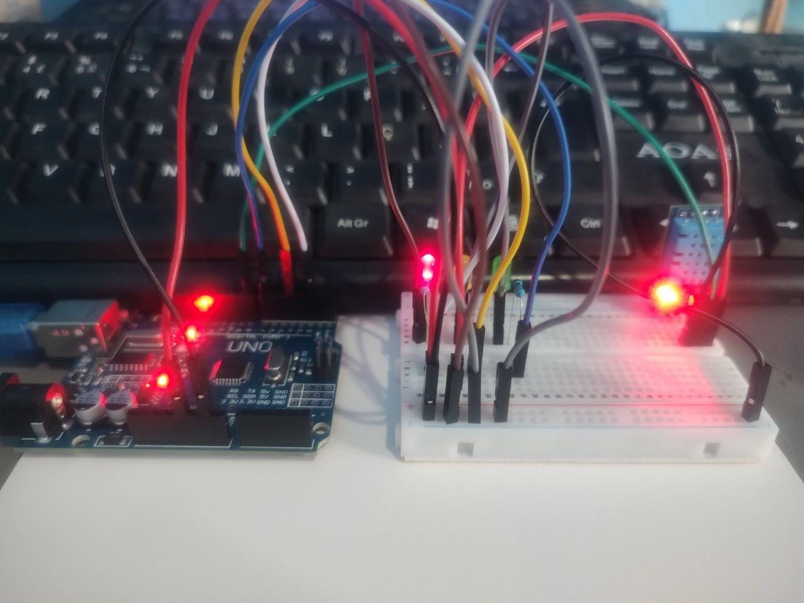
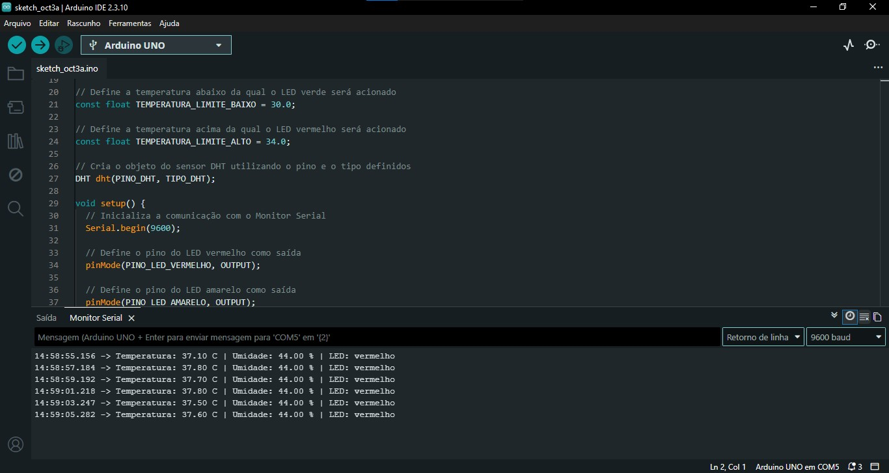
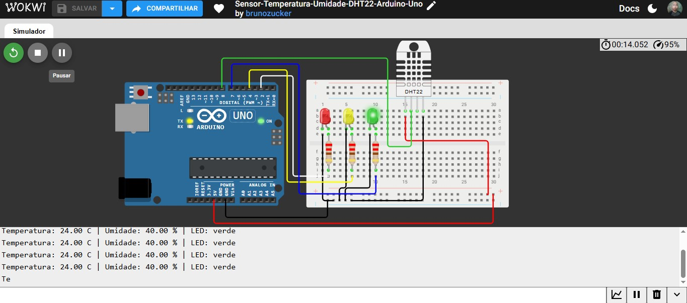

# 🌡️ Sensor-Temperatura-Umidade-DHT11-22-Arduino-Uno

Medidor de temperatura e umidade com Arduino Uno e sensor DHT, testado no Wokwi com o DHT22 e em hardware real com o DHT11, usando o mesmo código nos dois.

---

## 📋 Sobre o projeto

A ideia foi ler temperatura e umidade com um sensor da família DHT e indicar a faixa de temperatura com três LEDs: verde, amarelo e vermelho. Os valores também aparecem no Monitor Serial.

O destaque do projeto é que o **mesmo código** foi validado em dois ambientes:

- **Simulação no Wokwi:** com o sensor DHT22.
- **Hardware físico:** com o sensor DHT11, montado numa protoboard e lido pelo Monitor Serial no notebook.

O que muda de um para o outro é o tipo do sensor, definido em uma única linha do código, e a ordem dos pinos na ligação.

O projeto foi feito como parte do meu portfólio prático de sistemas embarcados.

▶️ [Abrir a simulação no Wokwi](https://wokwi.com/projects/476881465503316993)

---

## 🛠 Ferramentas utilizadas

### Simulação (Wokwi)
- Arduino Uno
- Sensor DHT22
- Protoboard
- 3 LEDs (vermelho, amarelo e verde)
- 3 resistores de 220 Ω

### Hardware físico
- Arduino Uno
- Módulo sensor DHT11 (3 pinos)
- Protoboard
- 3 LEDs (vermelho, amarelo e verde)
- 3 resistores de 220 Ω
- Notebook com Monitor Serial

### Software
- Linguagem C++ (Arduino)
- Biblioteca DHT

---

## 🏗 O que foi montado

O circuito tem o sensor DHT ligado ao pino 8 e três LEDs, cada um com um resistor de 220 Ω em série.

### Pinagem

| Componente | Pino do Arduino Uno |
|---|---|
| Sensor DHT (dados) | 8 |
| LED vermelho | 2 |
| LED amarelo | 4 |
| LED verde | 7 |

---

## 🔀 DHT11 x DHT22: o que muda

O código é o mesmo, mas a ligação dos pinos é diferente entre o sensor do simulador e o sensor físico.

### Ordem dos pinos

| | DHT22 (Wokwi) | DHT11 (físico) |
|---|---|---|
| Quantidade de pinos | 4 | 3 |
| Ordem (da esquerda para a direita) | VCC, SDA (dados), NC, GND | GND, DAT (dados), VCC |
| Pino NC | Presente e sem ligação | Não existe |

Repare que a ordem é **invertida**: no DHT22 do Wokwi o VCC fica na esquerda e o GND na direita, enquanto no DHT11 físico o GND fica na esquerda e o VCC na direita. Na montagem real, vale sempre conferir as legendas impressas na placa do módulo, porque a ordem pode variar entre fabricantes.

### Diferenças entre os sensores

| | DHT11 | DHT22 |
|---|---|---|
| Precisão da temperatura | cerca de ±2 °C | cerca de ±0,5 °C |
| Faixa de temperatura | 0 a 50 °C | -40 a 80 °C |
| Faixa de umidade | 20 a 80% | 0 a 100% |

### Como trocar o sensor no código

O tipo do sensor é definido em uma única linha no início do código:

```cpp
// Define o tipo de sensor DHT utilizado
#define TIPO_DHT DHT11
```

Para usar o DHT22 (como no Wokwi), basta trocar para:

```cpp
#define TIPO_DHT DHT22
```

O intervalo de 2 segundos entre as leituras atende aos dois sensores.

---

## 🔧 Como funciona

1. A cada 2 segundos o Arduino lê a temperatura (em °C) e a umidade relativa do sensor.
2. Se a leitura falhar, o Monitor Serial mostra "Erro ao ler o sensor DHT" e o ciclo recomeça.
3. Com a leitura válida, o código escolhe qual LED acender:

| Temperatura | LED aceso |
|---|---|
| Abaixo de 30 °C | Verde |
| De 30 °C até 34 °C | Amarelo |
| Acima de 34 °C | Vermelho |

4. Os valores e o LED aceso são exibidos no Monitor Serial, neste formato:

```
Temperatura: 28.50 C | Umidade: 60.00 % | LED: verde
```

Os limites de 30 °C e 34 °C ficam em constantes no começo do código e podem ser ajustados.

---

## 💻 Código

```cpp
// Sensor-Temperatura-Umidade-DHT11-22-Arduino-Uno

#include <DHT.h>

// Define o tipo de sensor DHT utilizado
#define TIPO_DHT DHT11

// Pino Digital 8 onde está conectado o sensor DHT
#define PINO_DHT 8

// Pino Digital 2 onde está conectado o LED vermelho
#define PINO_LED_VERMELHO 2

// Pino Digital 4 onde está conectado o LED amarelo
#define PINO_LED_AMARELO 4

// Pino Digital 7 onde está conectado o LED verde
#define PINO_LED_VERDE 7

// Define a temperatura abaixo da qual o LED verde será acionado
const float TEMPERATURA_LIMITE_BAIXO = 30.0;

// Define a temperatura acima da qual o LED vermelho será acionado
const float TEMPERATURA_LIMITE_ALTO = 34.0;

// Cria o objeto do sensor DHT utilizando o pino e o tipo definidos
DHT dht(PINO_DHT, TIPO_DHT);

void setup() {
  // Inicializa a comunicação com o Monitor Serial
  Serial.begin(9600);

  // Define o pino do LED vermelho como saída
  pinMode(PINO_LED_VERMELHO, OUTPUT);

  // Define o pino do LED amarelo como saída
  pinMode(PINO_LED_AMARELO, OUTPUT);

  // Define o pino do LED verde como saída
  pinMode(PINO_LED_VERDE, OUTPUT);

  // Inicializa o sensor DHT
  dht.begin();
}

void loop() {
  // Aguarda 2 segundos antes de realizar uma nova leitura
  delay(2000);

  // Realiza a leitura da temperatura em graus Celsius
  float temperatura = dht.readTemperature();

  // Realiza a leitura da umidade relativa do ar
  float umidade = dht.readHumidity();

  // Verifica se houve erro na leitura da temperatura ou da umidade
  if (isnan(temperatura) || isnan(umidade)) {
    Serial.println("Erro ao ler o sensor DHT");
    return;
  }

  // Cria uma variável para armazenar o nome do LED que deverá acender
  String ledAceso;

  // Verifica se a temperatura está abaixo do limite inferior
  if (temperatura < TEMPERATURA_LIMITE_BAIXO) {
    ledAceso = "verde";

  // Verifica se a temperatura está dentro da faixa intermediária
  } else if (temperatura <= TEMPERATURA_LIMITE_ALTO) {
    ledAceso = "amarelo";

  // Caso a temperatura esteja acima do limite superior
  } else {
    ledAceso = "vermelho";
  }

  // Acende o LED verde somente quando a temperatura estiver na faixa verde
  digitalWrite(PINO_LED_VERDE, ledAceso == "verde");

  // Acende o LED amarelo somente quando a temperatura estiver na faixa amarela
  digitalWrite(PINO_LED_AMARELO, ledAceso == "amarelo");

  // Acende o LED vermelho somente quando a temperatura estiver na faixa vermelha
  digitalWrite(PINO_LED_VERMELHO, ledAceso == "vermelho");

  // Exibe o texto "Temperatura:" no Monitor Serial
  Serial.print("Temperatura: ");

  // Exibe o valor da temperatura medida
  Serial.print(temperatura);

  // Exibe a unidade de temperatura em graus Celsius
  Serial.print(" C | Umidade: ");

  // Exibe o valor da umidade medida
  Serial.print(umidade);

  // Exibe a unidade de umidade em porcentagem
  Serial.print(" % | LED: ");

  // Exibe qual LED está aceso
  Serial.println(ledAceso);
}
```

---

## 📸 Evidências do funcionamento

### Hardware físico com DHT11
O circuito montado na protoboard com o sensor DHT11 e os três LEDs.



### Hardware físico: Monitor Serial
O Monitor Serial no notebook exibindo as leituras do DHT11 no hardware real.



### Simulação no Wokwi com DHT22
O mesmo código rodando no simulador, com o sensor DHT22.



---

## 📁 Arquivo do diagrama

O arquivo `diagram.json` corresponde à simulação com o **DHT22** no Wokwi e pode ser importado direto no simulador. Lembre de adicionar a biblioteca **DHT sensor library** no projeto.

[📥 Download — diagram.json](diagram.json)

---

## 💡 O que aprendi com esse projeto

O principal foi ver que o mesmo código pode servir para sensores diferentes, desde que o tipo seja definido num único ponto. Com o `#define TIPO_DHT`, trocar entre DHT11 e DHT22 vira uma mudança de uma linha.

Também ficou claro que o sensor simulado e o sensor físico não têm a mesma ligação. O DHT22 do Wokwi tem quatro pinos, com um deles sem uso, e o DHT11 físico em módulo tem três pinos, com a ordem invertida. Por isso conferir o pinout antes de ligar é essencial.

Outro ponto foi o valor de testar nos dois ambientes: o simulador ajuda a validar a lógica rápido, e o hardware real confirma que tudo funciona de verdade.

---

## ⚠️ Sobre o projeto

Essa simulação é uma base de estudo. Os limites de temperatura são fixos e não há histerese, então com a temperatura oscilando bem perto de 30 °C ou 34 °C o LED pode alternar com facilidade. Uma evolução natural seria exibir os valores num display e usar `millis()` no lugar do `delay()`.

---

## 🚀 Próximos projetos

Outros projetos de sistemas embarcados serão postados em breve, com níveis de complexidade maiores.

---

## 👤 Autor: Bruno Zucker
